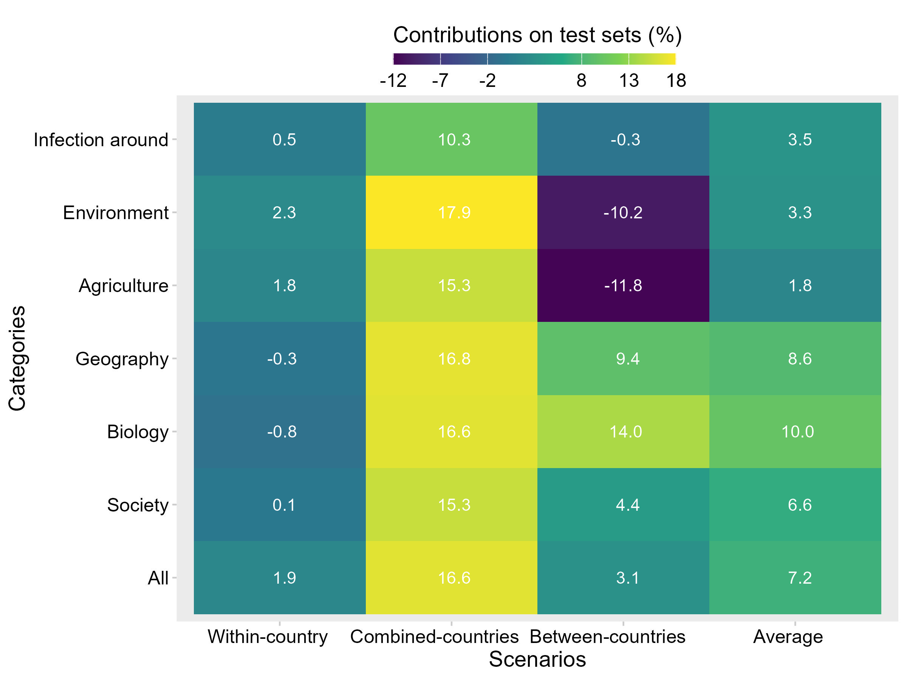
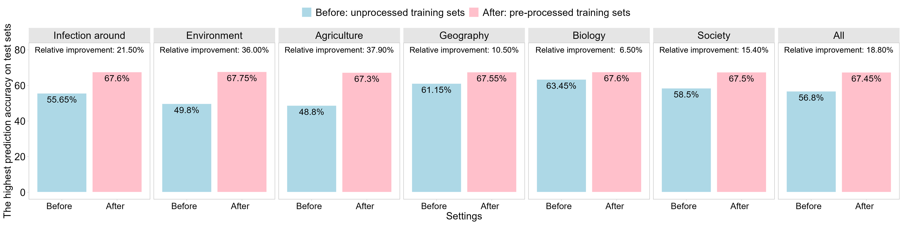

# Identifying Key Aspects to Enhance Predictive Modeling for Early Identification of Schistosomiasis Hotspots to Guide Mass Drug Administration
 
This Github page provides code for reproducing the results in the manuscript: ``Identifying Key Aspects to Enhance Predictive Modeling for Early Identification of Schistosomiasis Hotspots to Guide Mass Drug Administration'' by Y. Chen, F. Luo, L. Martinez, S., Jiang, and Y. Shen.

## Summary
Schistosomiasis infection is a major public health problem. The related study shows that mass drug administration (MDA), a widely used method for achieving preventive chemotherapy with praziquantel (PZQ), does not prevent reinfection and the formation of high-risk areas (i.e., hotspots) between MDA rounds. Especially in endemic regions, multiple rounds of MDA are typically required for the elimination of schistosomiasis. This study aims to develop prediction methods that identify hotspots before the first MDA round (i.e., early identification) to guide subsequent treatment efforts. Accurate and early identification of hotspots, however, faces challenges due to a lack of sufficient infection data. Furthermore, the ratio of hotspots to non-hotspots is often highly imbalanced, making it even more difficult to extract useful information from the available baseline infection data to identify these hotspots. To overcome these challenges, we collected secondary data from public sources, applied spatial weighting techniques to construct predictors, and employed synthetic sampling-based methods to mitigate hotspots imbalance. We then developed statistical and machine learning models for hotspot prediction. Our method supports MDA efforts, contributes to  schistosomiasis elimination, and improves public health.
## Results
Compared to the approach using only baseline infection data, the spatially weighted data fusion method achieved relative improvements (RIs) in hotspot prediction accuracy by fusing baseline infection data with each predictor category: 10% with biology, 8.6% with geography, 6.6% with society, 3.5% with baseline infection data around villages, 3.3% with environment, 1.8% with agriculture, and 7.2% with all predictors. Furthermore, across the same predictor combinations, applying the sampling-based technique with the proposed method yielded RIs of 6.5%-37.9%, compared to the approach that did not address the imbalance.
<figure id="Figure4">
  

  
    

  <figcaption>
  <strong>Figure 1:</strong> Relative improvements (RIs) in prediction accuracy on test sets for the three scenarios from the proposed spatially weighted data fusion method using different predictor categories, compared to the approach using only baseline infection data..
  </figcaption>
</figure>

<figure id="Figure4">
  

  
    

  <figcaption>
  <strong>Figure 2:</strong>  Relative improvements (RIs), in prediction accuracy on unprocessed test sets, obtained from the models trained using pre-processed synthetic data based on the proposed different predictor configurations, compared to models using unprocessed original imbalanced training data, where the best model with the highest prediction accuracy was considered for each method (i.e., y-axis).
  </figcaption>
</figure>
